# Proyecto .NET 8.0 + React (Vite) con React Query

Este proyecto integra un **backend en .NET 8.0** y un **frontend en React utilizando Vite**, usando **React Query** para manejar consultas HTTP y cache de datos.  

---

## Índice

1. [Requisitos](#requisitos)
2. [Ejecución del backend](#ejecución-del-backend)
3. [Ejecución del frontend](#ejecución-del-frontend)
4. [Base de datos SQLite](#base-de-datos-sqlite)
5. [Evidencias](#evidencias)

---

## Requisitos

Para ejecutar este proyecto en un entorno local, se necesitan los siguientes requisitos:

- **.NET 8.0 SDK**: Para compilar y ejecutar el backend.
  - [Descargar .NET 8.0](https://dotnet.microsoft.com/download/dotnet/8.0)
- **Node.js 20+**: Para ejecutar el frontend.
  - [Descargar Node.js](https://nodejs.org/)
- **npm o yarn**: Administrador de paquetes para instalar dependencias del frontend.
- **Visual Studio Code** u otro IDE de preferencia.
- **Navegador moderno** (Chrome, Edge, Firefox) para probar la interfaz.

Opcional:
- Postman o similar para probar las rutas API del backend.
- Git para clonar o gestionar versiones del proyecto.

---

## Ejecución del backend

1. Abrir terminal y moverse a la carpeta del backend:

```bash
cd backend/ecommerce-net/
```

2. Restaurar dependencias (si es necesario):

```bash
dotnet restore
```

3. Ejecutar servicio de Productos (Terminal 1):

```bash
cd src/api/ProductService
dotnet run
```

4. Ejecutar servicio de Transacciones (Terminal 2):

```bash
cd src/api/TransactionService
dotnet run
```

4. El backend quedará corriendo por defecto en `https://localhost:5001` (Servicio de Transacciones) y `http://localhost:5002` (Servicio de Productos).

---

## Ejecución del frontend

1. Abrir terminal y moverse a la carpeta del frontend:

```bash
cd frontend/ecommerce-react
```

2. Instalar dependencias:

```bash
npm install
# o
yarn
```

3. Ejecutar la aplicación:

```bash
npm run dev
# o
yarn dev
```

4. Abrir navegador en `http://localhost:5173`.

---

## Base de datos SQLite

Este proyecto utiliza **SQLite** como base de datos. La base de datos ya está incluida, pero si necesitas generar o actualizar las migraciones, sigue estos pasos en la raíz del proyecto backend/ecommerce-net:

### Productos

1. **Crear migración inicial**

```bash
dotnet ef migrations add Initial --context ProductDbContext --project src/infrastructure --startup-project src/api/ProductService
```

2. **Actualizar la base de datos**

```bash
dotnet ef database update --context ProductDbContext --project src/infrastructure --startup-project src/api/ProductService
```

### Transacciones

1. **Crear migración inicial**

```bash
dotnet ef migrations add Initial --context TransactionDbContext --project src/infrastructure --startup-project src/api/TransactionService
```

2. **Actualizar la base de datos**

```bash
dotnet ef database update --context TransactionDbContext --project src/infrastructure --startup-project src/api/TransactionService
```

**Notas:**

- `--context` indica el DbContext a usar.
- `--project` indica dónde están las entidades y contexto.
- `--startup-project` indica el proyecto de arranque (API).
- Ejecutar los comandos desde la raíz del proyecto.

---

## Evidencias

### 1. Acciones de la tabla

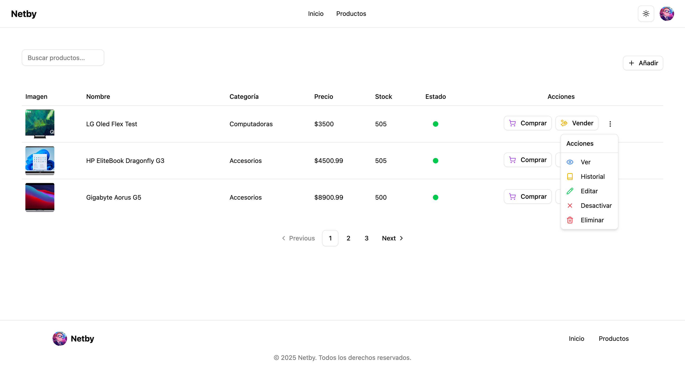

### 2. Listado dinámico de productos y transacciones con paginación

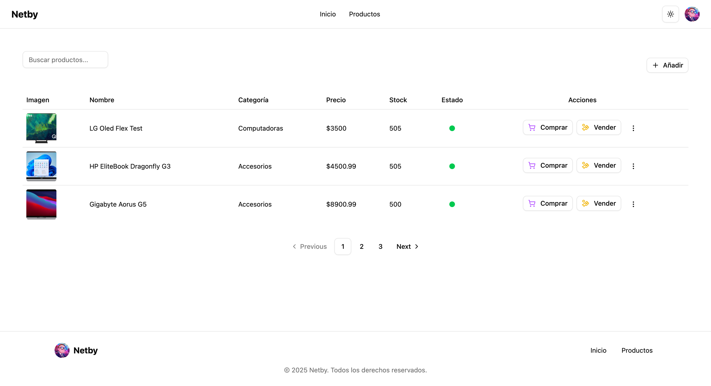

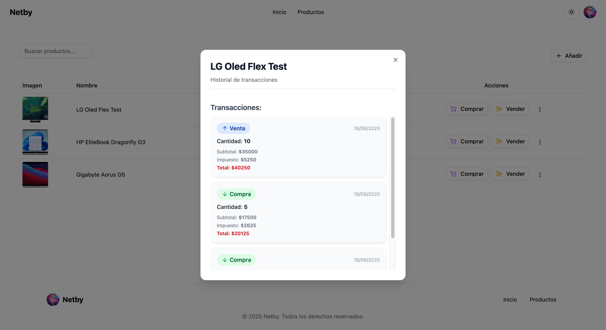

### 3. Pantalla para la creación de productos

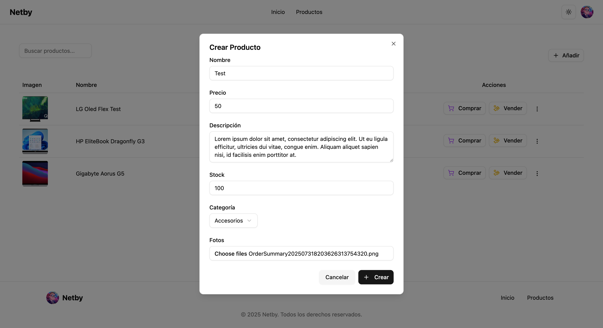

### 4. Pantalla para la edición de productos

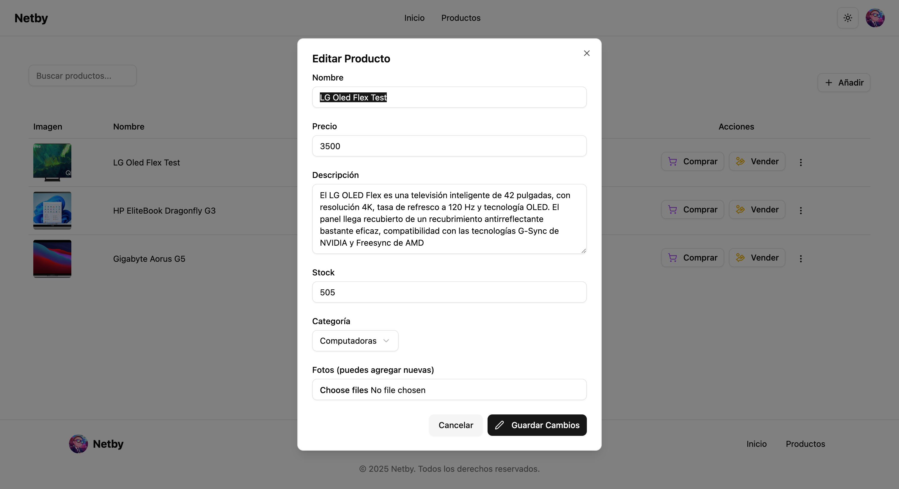

### 5. Pantalla para la creación de transacciones


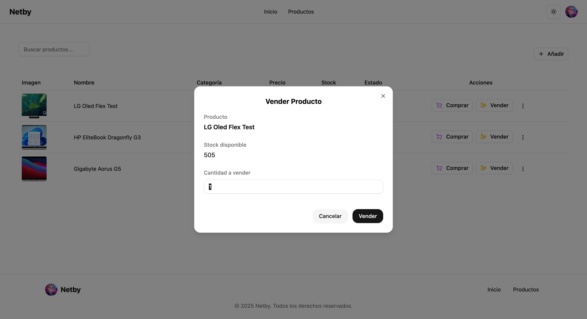

### 6. Pantalla de filtros dinámicos

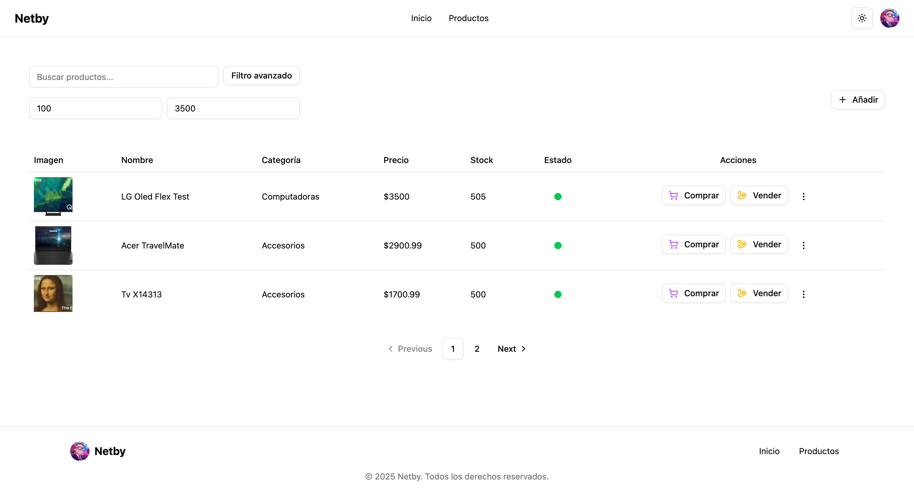
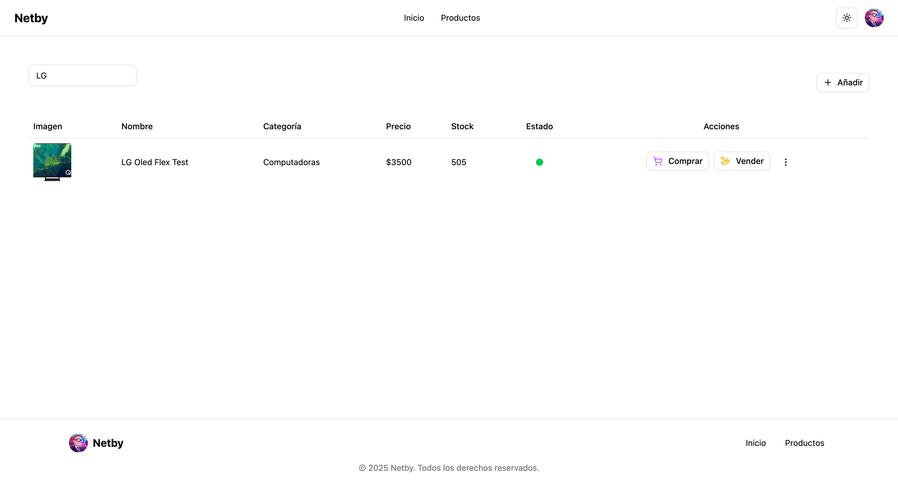
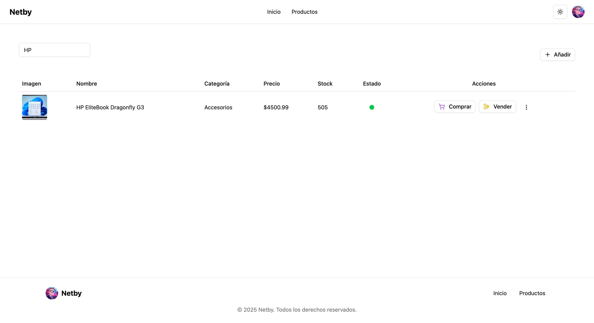

### 7. Pantalla para la consulta de información de un formulario (extra)

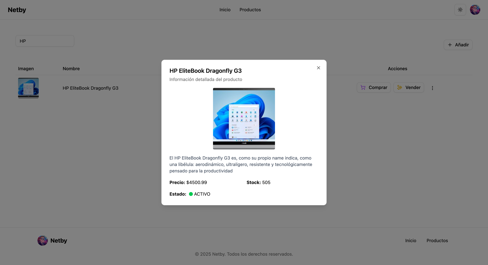
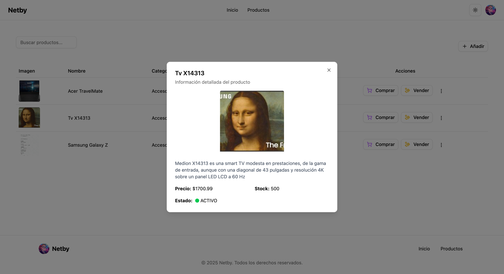
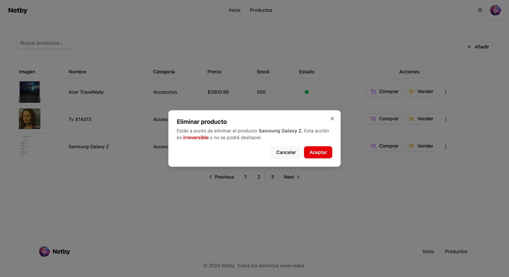
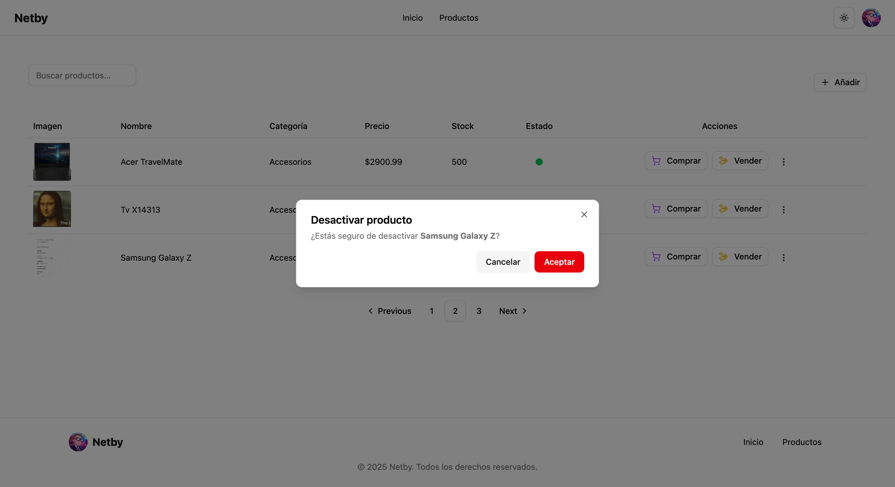

---

## Notas finales

- Asegurarse de que el backend esté corriendo antes de iniciar el frontend.
- Actualizar las URLs si cambias puertos.
- Mantener las dependencias actualizadas.
- Las credenciales del Cloudinary ya se encuentran en el proyecto.


